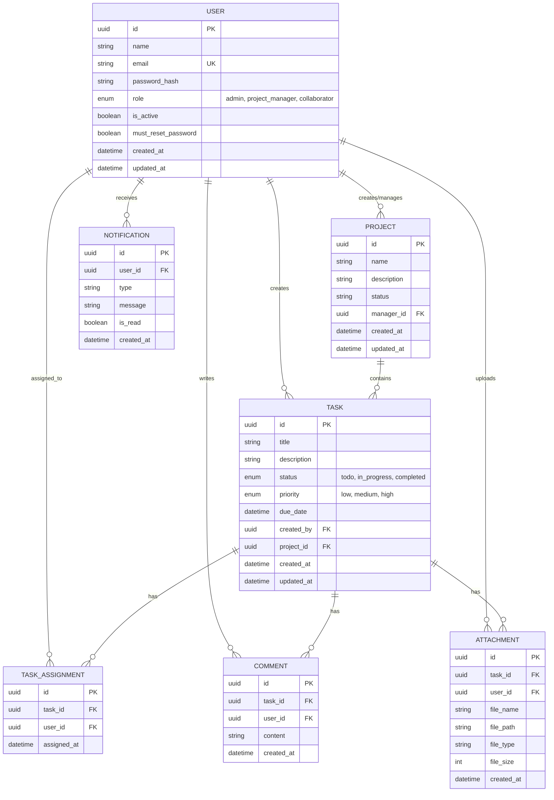
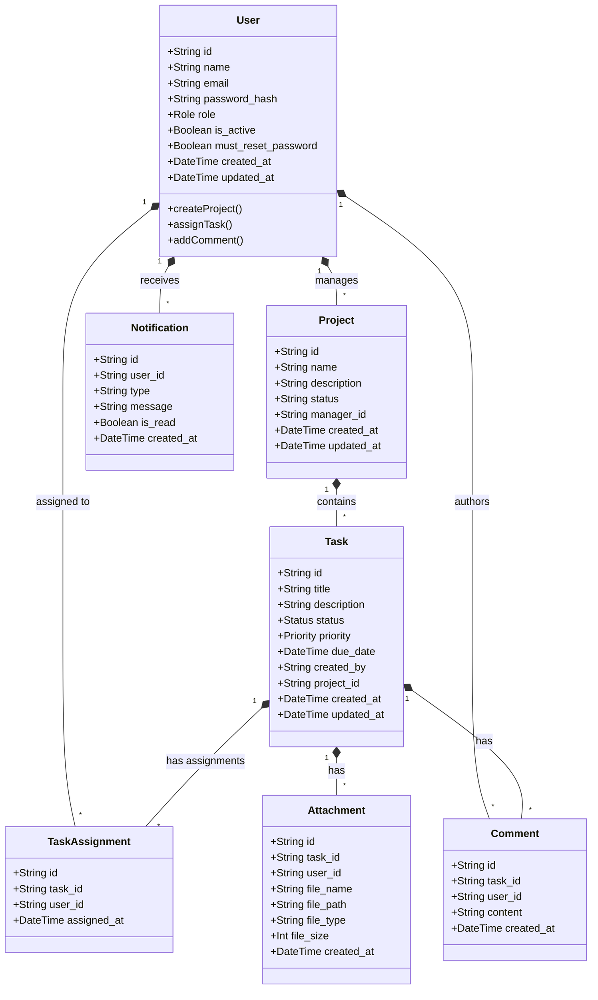
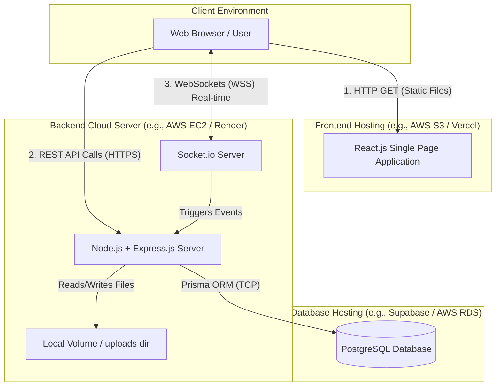

# Task Management System - System Documentation

This document contains the core architectural, database, and API documentation for the Task Management System (TMS), as required by the Software Requirements Specification (SRS).

---

## 1. Entity-Relationship (ER) Diagram

The ER diagram illustrates the database tables and their relationships. 
- **Users** can manage multiple **Projects**.
- **Projects** contain multiple **Tasks**.
- **Tasks** can be assigned to multiple **Users** via the **TaskAssignment** junction table.
- **Tasks** can have multiple **Comments** and **Attachments**.
- **Users** receive **Notifications**.

---

## 2. Class Diagram

This diagram represents the domain models (Prisma models) mapped as Object-Oriented classes, highlighting properties and structural relationships.

---

## 3. Database Design

### Overview
The system uses **PostgreSQL** as its relational database management system, interfaced via **Prisma ORM**.

### Key Design Decisions
1. **Primary Keys:** UUIDs (Universally Unique Identifiers) are used for all primary keys (`id` fields) instead of auto-incrementing integers. This prevents ID enumeration attacks and ensures global uniqueness.
2. **Referential Integrity:** 
   - Cascade deletes are implemented. For example, deleting a `Project` automatically deletes its associated `Tasks`. Deleting a `Task` deletes its `Comments`, `Attachments`, and `TaskAssignments`.
3. **Data Integrity (Enums):**
   - `Role`: Restricted to `admin`, `project_manager`, `collaborator`.
   - `Status`: Restricted to `todo`, `in_progress`, `completed`.
   - `Priority`: Restricted to `low`, `medium`, `high`.
4. **Junction Tables:** A `TaskAssignment` table is used to properly resolve the many-to-many relationship between Users and Tasks.
5. **Security:** Passwords are never stored in plain text. They are hashed securely using `bcrypt` and stored in the `password_hash` column.

---

## 4. Deployment Diagram

This diagram visualizes the physical deployment architecture of the system across cloud infrastructure.

---

## 5. API Documentation

The backend exposes a RESTful API. All protected endpoints require a valid JWT in the `Authorization: Bearer <token>` header.

### 5.1 Authentication (`/api/auth`)
| Method | Endpoint | Description | Access |
|---|---|---|---|
| POST | `/login` | Authenticates user and returns JWT. | Public |
| POST | `/register` | Self-registers a new collaborator. | Public |
| POST | `/reset-password` | Resets password on first login. | Auth Required |

### 5.2 Users (`/api/users`)
| Method | Endpoint | Description | Access |
|---|---|---|---|
| GET | `/` | Retrieves list of all users. | Admin, Manager |
| POST | `/` | Creates a new user. | Admin |
| GET | `/:id` | Retrieves a specific user by ID. | Admin |
| PUT | `/:id` | Updates user details. | Admin |
| PATCH | `/:id/deactivate` | Deactivates a user account. | Admin |
| PATCH | `/:id/activate` | Activates a user account. | Admin |
| PATCH | `/:id/role` | Changes user role. | Admin |

### 5.3 Projects (`/api/projects`)
| Method | Endpoint | Description | Access |
|---|---|---|---|
| GET | `/` | Get all projects. | Auth Required |
| POST | `/` | Create a new project. | Manager |
| GET | `/:id` | Get project details. | Auth Required |
| PUT | `/:id` | Update project details. | Manager |
| DELETE| `/:id` | Delete a project. | Manager |

### 5.4 Tasks (`/api/tasks`)
| Method | Endpoint | Description | Access |
|---|---|---|---|
| GET | `/` | Get all tasks. | Auth Required |
| POST | `/` | Create a new task. | Manager |
| GET | `/:id` | Get task details. | Auth Required |
| PUT | `/:id` | Update task details. | Manager |
| DELETE| `/:id` | Delete a task. | Manager |
| PATCH | `/:id/status` | Update task status (e.g. to Done). | Manager, Collaborator|
| POST | `/:id/assign` | Assign users to a task. | Manager |
| POST | `/:id/comments` | Add a comment to a task. | Auth Required |
| GET | `/:id/comments` | Retrieve comments for a task. | Auth Required |
| POST | `/:id/attachments`| Upload a file attachment. | Auth Required |
| DELETE| `/:id/attachments/:attachmentId`| Remove an attachment. | Auth Required |

### 5.5 Notifications (`/api/notifications`)
| Method | Endpoint | Description | Access |
|---|---|---|---|
| GET | `/` | Get user's notifications. | Auth Required |
| PATCH | `/:id/read` | Mark a specific notification as read.| Auth Required |
| PATCH | `/read-all` | Mark all notifications as read. | Auth Required |
